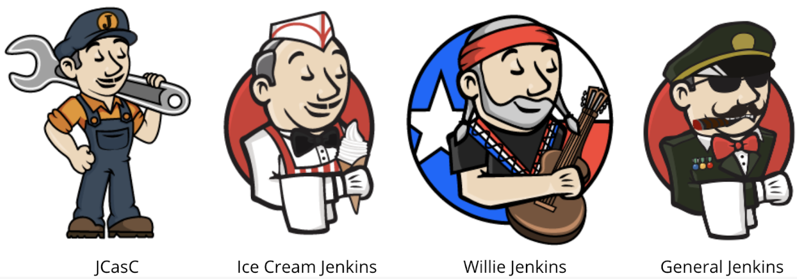
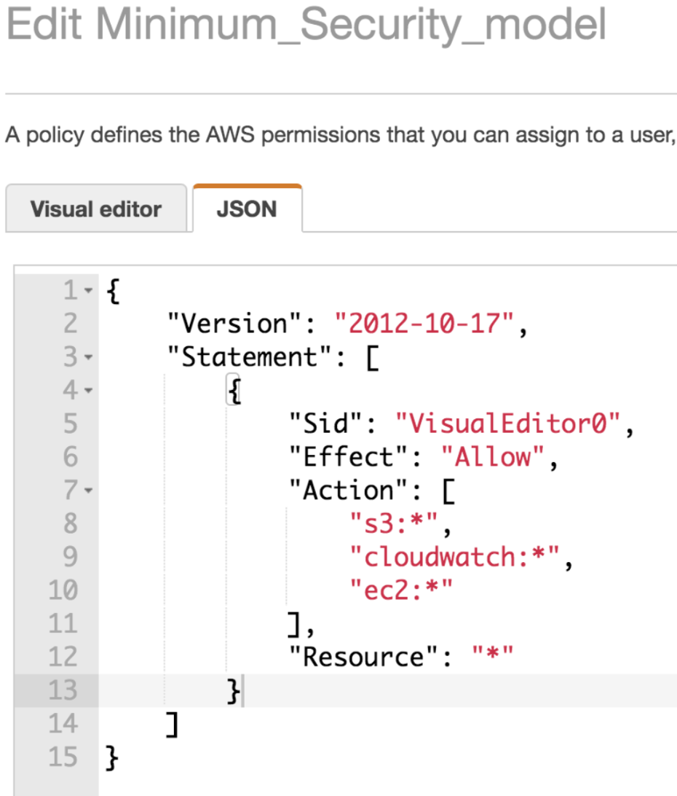
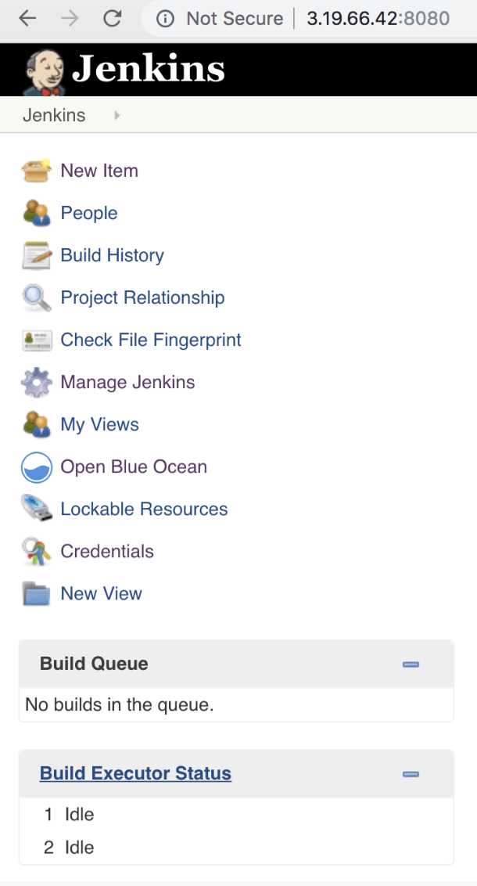
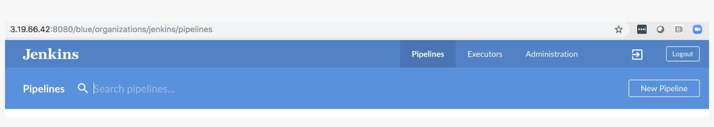

# Introduction
To facilitate software development, Continuous Integration / Continuous Development (CI/CD) has become a swiss army knife of development, deployment, and testing. One of the most popular and oldest currently maintained frameworks for CI/CD is called Jenkins.

Jenkins comes originally from the Hudson project which had very similar features and functionality, but was controlled by Sun Microsystems. Jenkins was released in 2011 and is open source. In addition, Jenkins is highly modular and supports a multitude of plugins. We will cover a few of the plugins at a higher level in this course.

Most of our focus in CI/CD will be on pipelines. With pipelines we are able to use code checked into a Git repository to control the execution, linting, security testing, and performance testing of code. Within the course we will also explore using multiple branches for different levels such as development, staging, and production.

## Course Overview Skills Check

This course is taught with the assumption that you have completed courses 1 and 2 of the Cloud DevOps Nanodegree. We will move very quickly over sections which cover the same material addressed in those previous courses, and reinforce your understanding of them.

The fundamentals of AWS are addressed in previous courses. You are assumed to have had some experience using the command line in a Linux or UNIX environment. New subject matters such as Jenkins, Pipelines, Prometheus, and Ansible are taught with the expectation that you have no experience with them. We will attempt to review material very frequently in the form of short quizzes and practice exercises to ensure you are mastering the skills and concepts. You will learn by doing, in the Udacity way!

## Course Overview

I am excited that we will be able to address a wide variety of subject matter throughout this course! Our main focus will be on CI/CD and pipelines in the first two lessons of this course. Next we will move to configuration management using Ansible, and we will conclude with monitoring and log aggregation.

The idea for you as a student is to be able to develop the skills needed to: a) create an environment from code (infrastructure as code) with Ansible; b) create a development pipeline on this infrastructure with Jenkins; and c) monitor and maintain this infrastructure through the use of monitoring, metrics, and log analytics using Prometheus and ELK stack.

One of the beautiful things about the field of DevOps is the flexibility and interoperability of the different components, which can be compared to Lego pieces. In these lessons we will start to understand how the building blocks of development, monitoring, and deployment fit together and complement each other.

It should also be noted that we are endeavoring to use some of the most common representations of these technologies. There are many very similar, but different, pieces of software which perform the same or similar tasks. When will discuss some but not all of these alternatives.

## Project Overview

The most important way to learn something is by doing it. This is why the end of this course will lead into a project where you can show that you have acquired all of the skills taught in this course. In our project, you will deploy and run an instance on AWS, configure Jenkins, and create a pipeline to deploy a static website on S3.

[Interview with the instructor](https://youtu.be/HN4FeArAz5A).

# Jenkins: Intro
So, now we're going to talk about one of the core technologies that we're using in this course, which is **Jenkins**. 

**Jenkins** is the swiss army knife of build tools, and it gives you a huge amount of extendability, flexibility, with a lot of plugins and can use and support a lot of different languages. 

Jenkins made public in 2011. It was an offshoot from Microsystems' Hudson which the open-source community was concerned about having a CI/CD platform which was under control of Sun Microsystems. So, that was the source of the creation of Jenkins, because they wanted to have this open-source product to do all of these magical things that we use inside this the CI/CD space.

So, this is just fun! These are some of the Jenkins icons, and this is relevant because for instance Jenkins configuration as code.

<p align="center">

</p>

One of the most important concepts is **infrastructure as code**. Jenkins configuration as code is also very relevant to that as well, meaning that your configurations is checked into a source control repository such as Git.

The evolution of Jenkins, the current cutting edge is **Jenkinds-X**, which really brings in Docker microservices and Kubernetes. This is the next generation of Jenkins (although not covered in this course).

[video](https://youtu.be/E18pi8GYwWE)

# AWS Setup
See [this video](https://youtu.be/Iqt0zDm3wCU) for AWS setup.

# IAM and EC2 Setup
See [this video](https://youtu.be/Wl8tLO59Y90) and also [this one](https://youtu.be/_VZQ954tPfM). 

# Installing Jenkins
See [this video](https://youtu.be/iVxigCxK5Q8).

### Commands for Installing Jenkins

```bash
sudo apt-get update
sudo apt install -y default-jdk
wget -q -O - https://pkg.jenkins.io/debian/jenkins.io.key | sudo apt-key add -
sudo sh -c 'echo deb https://pkg.jenkins.io/debian-stable binary/ > /etc/apt/sources.list.d/jenkins.list'
sudo apt-get update
sudo apt-get install -y jenkins
```

### Managing Plugins in Jenkins

Here we will install the Blue Ocean Plugin into Jenkins.

Blue Ocean essentially provides a re-skinned interface for working with Jenkins.

[video1](https://youtu.be/9vj9zukg8ig)

[video2](https://youtu.be/bGwrSLfo3Ms)

# CI/CD

-   What came before CI/CD
-   What is CI/CD?
-   Components of CI/CD

See [this video](https://youtu.be/66j2hTy4G68).

### Definitions

“Continuous Integration (CI) is a development practice where developers integrate code into a shared repository frequently, preferably several times a day. Each integration can then be verified by an automated build and automated tests.” Source:  [https://codeship.com/continuous-integration-essentials](https://codeship.com/continuous-integration-essentials)

“Continuous deployment (CD) is a strategy for software releases wherein any code commit that passes the automated testing phase is automatically released into the production environment, making changes that are visible to the software's users.”  [https://searchitoperations.techtarget.com/definition/continuous-deployment](https://searchitoperations.techtarget.com/definition/continuous-deployment)

<p align="center">

</p>

### Pipelines Overview

One of the key best practices of DevOps is to be able to do “Infrastructure as Code”. A pipeline enables us to store our Jenkins project configuration as code in a Git repository.

The previous way of doing this was to store the configurations as text on the Jenkins server. However, it is far superior to store this in a Git repository, because that way we version it, review it, perform pull requests, and integrate it just like the rest of our code.

A pipeline contains steps which have different actions performed as part of those steps.

### Key Skills and Concepts from CI / CD Lesson

You’ve learned a lot in this lesson! Here are some of the key skills and topics we covered in the course so far:

-   Set up IAM user, role, group & policy
-   Launched EC2 instance
-   Installed Jenkins
-   Enabled BlueOcean
-   Showed the components of CI/CD
-   Described a pipeline

## Practice Exercise 1

**Working through these practice exercises will set you up for success in your project at the end of the course!**

As a practice exercise, please do the following:

-   Set up IAM user, role, group and policy
-   Now check your work by reviewing your policy JSON. It should look like the following:

<p align="center">

</p>

## Practice Exercise 2

Here is another practice exercise. Please do the following:

-   Launch a t2.micro EC2 instance
-   Install Jenkins
-   Recall these are the steps to install Jenkins:

```
sudo apt-get update
sudo apt install -y default-jdk
wget -q -O - https://pkg.jenkins.io/debian/jenkins.io.key | sudo apt-key add -
sudo sh -c 'echo deb https://pkg.jenkins.io/debian-stable binary/ > /etc/apt/sources.list.d/jenkins.list'
sudo apt-get update
sudo apt-get install -y jenkins

```

-   Take a screenshot of the Homepage after logging into Jenkins. Check your work by comparing your screenshot to the following. Include the URL bar in your screenshot.

<p align="center">

</p>

## Practice Exercise 3

For the last practice exercise for this lesson, please do the following:

-   Install the Blue Ocean Plugin.
-   To check your work, compare the screen you see inside of Blue Ocean with the following. Make sure you include the URL bar in your comparison also.

<p align="center">

</p>


