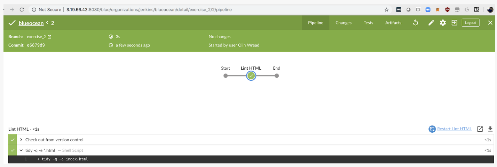

# S3 Jenkins Setup
Next we’ll install the S3 plugin into Jenkins.

See [this video](https://youtu.be/fy8qkh7uI54).

# Intro to Blue Ocean
We installed the Blue Ocean plugin into Jenkins in the last lesson, now let’s begin discussing and using it more.

See [this video](https://youtu.be/L1p9eUIKIAw).

### Blue Ocean Overview

-   Optimizes GUI for pipelines
-   Re-skins Jenkins to make management easier
-   Has built-in diagnostics

<p align="center">

</p>


### Blue Ocean Setup Summary

-   One repo per project
-   Git repos can be re-used in multiple pipelines
-   Make Jenkins become IasC (Infrastructure as Code)

# Adding a GitHub repo to a Pipeline
In order to store Jenkins configurations as code it is necessary to use pipelines.

See [this video](https://youtu.be/Au49ZnAnWe0).

# Multiple Pipelines
See [this video](https://youtu.be/yUlIlnvljDI).

### Development and Staging Pipeline Summary

-   Development pipelines are kicked off very frequently and with continuous deployment will automatically update servers
-   Staging is where QA will test the environment so this needs to be kept more static to prevent interruptions

See [this video](https://youtu.be/Ezpg716RC7E).

### Multi-Pipeline Summary

-   There is no limit on the number of pipelines you can have.
-   Optimize for your environment - every setup is different.
-   Be careful with continuous deployment because you may overwrite the wrong thing.

# Pipeline Triggers

### Triggers Demo

Now let’s take a look at setting up a trigger, so we will continuously, “automagically,” check if our GitHub software has been updated, triggering the pipeline processes.

See [this video](https://youtu.be/dJubkXoQgbI).

### Pipeline Triggers Walkthrough

-   When code is pushed to the Git repository after a pull request, build automatically, i.e. continuously integrate
-   If the tests in a pipeline pass, deploy the code, i.e. continuously deploy

See [this video](https://youtu.be/9-YjFsph6iY).

# Pipeline Testing
See [this video](https://youtu.be/4WNvTUWZJLw).

### Testing - Key ideas

-   Linting is testing to check for syntax errors in code.
-   Security testing can be performed with a variety of software to test for CVE vulnerabilities.
-   Performance testing is done by setting up a smaller scale environment than production with Jenkins and running simulated host calls into that environment to see how it performs under load.
-   Integration testing is testing code from different modules to make sure it all works together.

## Pipeline Code for Uploading to S3

Here is the code I used to upload to S3, behind the scenes in the video:

```js
pipeline {
    agent any
    stages {
       stage('Upload to AWS') {
             steps {
                 withAWS(region:'us-east-2',credentials:'aws-static') {
                 sh 'echo "Uploading content with AWS creds"'
                     s3Upload(pathStyleAccessEnabled: true, payloadSigningEnabled: true, file:'index.html', bucket:'static-jenkins-pipeline')
                 }
             }
        }
    }
}
```

# Security Testing with Aqua

Aqua is a Jenkins plugin designed for testing Docker containers. It is one of many security vulnerability scanners available, testing against CVE (Common Vulnerabilities and Exposures).

We’ll install and show how to use Aqua next.

See [this video](https://youtu.be/euZxiuHmrjI).

### Aqua Testing Summary

-   Aqua is used for scanning Docker containers for CVE
-   Aqua depends on Docker
-   Aqua can be integrated into a testing pipeline in the Continuous Integration stage

See [this video](https://youtu.be/-KFuPHaV3gg).

#### Further Research on Testing

If you’d like to look into other types of tests, here are some resources:

-   Performance Testing:  [https://opensource.com/life/16/7/running-jmeter-jenkins-continuous-delivery-101](https://opensource.com/life/16/7/running-jmeter-jenkins-continuous-delivery-101)
-   Integration Testing:  [https://www.twilio.com/engineering/2017/01/09/how-to-setup-a-ci-build-for-integration-tests](https://www.twilio.com/engineering/2017/01/09/how-to-setup-a-ci-build-for-integration-tests)

# Deployment Strategies

See [this video](https://youtu.be/3DYFdgXsa74).

<p align="center">

</p>

<p align="center">

</p>

### Blue/Green Deployment Strategy

-   `apt install ansible`
-   `pip install boto`
-   Jenkins plugin CloudBees AWS Credentials Plugin
-   Configure AWS Credentials in Jenkins
-   Map credentials from Jenkins to Pipeline application

### Blue/Green Deployment IAM Policy

```js
{
    "Version": "2012-10-17",
    "Statement": [
        {
            "Sid": "VisualEditor0",
            "Effect": "Allow",
            "Action": [
                "s3:*",
                "cloudwatch:*",
                "route53:*",
                "ec2:*",
                "ec2:DescribeAccountAttributes",
                "elasticloadbalancing:*"
            ],
            "Resource": "*"
        },
        {
            "Sid": "VisualEditor1",
            "Effect": "Allow",
            "Action": "iam:CreateServiceLinkedRole",
            "Resource": "arn:aws:iam::*:role/aws-service-role/*"
        }
    ]
}

```

### Blue/Green Deployment Strategy (cont.)

-   Set up Private Route53 Zone
-   Configure Healthcheck
-   Run Blue Deployment
-   Run Green Deployment
-   Check Route53 entries

# Deployment Big Picture

See [this video](https://youtu.be/2K9fnIkNWyQ).

### Deployment Strategies Guide

-   Manual changes will get you in trouble sooner or later.
-   New feature code releases often require blue/green deployment due to scheme changes and/or to keep consistency.
-   To perform a bug fix of an existing product, a rolling deployment will be your most frequent choice.

# Deployment Practice
**Working through these exercises will give you valuable practice for your project work!**

To practice your skills with deployment and pipelines, please do the following:

-   Set up a “Hello World” pipeline in Blue Ocean.
-   Screenshot a successful run and compare it to my screenshot below.

The code for a “Hello World” pipeline is shown here:

```js
pipeline {
  agent any 
  stages {
    stage(‘Build’) {
      steps {
        sh ‘echo “Hello World”’
        sh ‘“
                  echo “Multiline shell steps works too”
                  ls -lah
               “‘
      }
    }
  }
}
```

<p align="center">

</p>

### Practice Exercise 2

-   Install “lint” onto your Jenkins Master. This is to check the HTML code for malformed tags.  `sudo apt install tidy`
-   Set up a Lint job.
-   Capture a screenshot after a successful Lint check of your html code, and compare it to the screenshot below.
    
    ```js
    pipeline {
      agent any
      stages {
        stage(‘Lint HTML’) {
          steps {
            sh ‘tidy -q -e *.html’
          }
        }
      }
    }
    ```

<p align="center">

</p>

### Practice Exercise 3

-   Install Jenkins plugin AWS CodePipeline.
-   Set up your AWS credentials with your access key and secret access key in Credentials.
-   Create your S3 bucket (must be unique).
-   Set up your pipeline. Note: your bucket name can’t be the same as mine.
-   Screenshot a successful run and compare it to mine below.

Here is the Pipeline code for performing the Tidy check:

```js
pipeline {
    agent any
    stages {
      stage(‘Lint HTML’) {
        steps {
          sh ‘tidy -q -e *.html’
        }
      stage(‘Upload to AWS’) {
        steps {
          withAWS(region:’us-east-1’,credentials:’blueocean’) {
            s3Upload(pathStyleAccessEnabled:true, payloadSigningEnabled: true, file:’index.html’, bucket:’c3pipelines’)
          }
        }
      }
    }
}
```

<p align="center">

</p>
