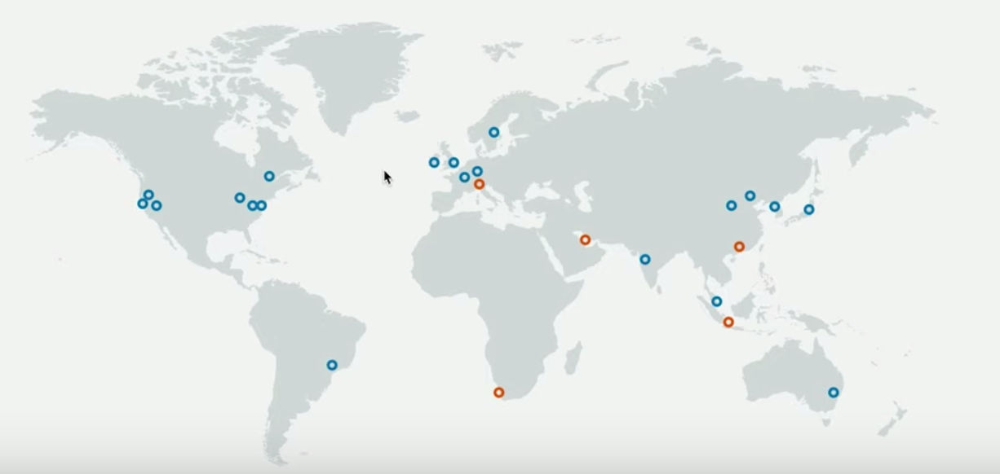

# What is Cloud Computing?
Cloud computing involves the delivery of IT resources such as databases, computer power, application, security, etc. over the internet. 

There are three characteristics of cloud computing:

- Pay-as-you-go
- Autoscaling
- Serverless

**Pay-as-you-go:** which means there are no long-term contracts, and you pay only for what you use. Sometimes you pay by the minute, hour, or even second. 

**Autoscaling:** simply means resources that grow or shrink or automatically scale based on demand. Servers can be provisioned almost instantly so that you don't have to guess about capacity or make huge capital investments in servers upfront. 

**Serverless:** this simply means that a cloud provider manages the servers for you. You, as the developer, simply write code. The cloud provider executes that code on some server somewhere and you're not concerned with that aspect. 

For more on cloud computing, you can also check out [this link](https://aws.amazon.com/what-is-cloud-computing/).

See the video [here](https://youtu.be/zjjgDZm6SwY).

# Types of Cloud Computing
There are three types of cloud computing:

- **Infrastructure-as-a-Service (IaaS)**
- **Platform-as-a-Service (PaaS)**
- **Software-as-a-Service (SaaS)**

**Infrastructure-as-a-Service** is when the provider supplies a _**virtual server**_ instance, storage, and mechanisms for you to manage the servers. Examples include _AWS_, _Rackspace_, _Digital Ocean_, and _Iron Mountain_, etc. 

**Platform-as-a-Service** this is when development tools are provided that are hosted on a provider's infrastructure, so they manage the hardware and operating system, and you focus on managing and deploying applications. Examples of these are _GoDaddy_, _Salesforcesforce.com_, etc.

**Software-as-a-Service** this delivers software applications over the internet that are run and managed by the service provider. Examples of this include _Google's Gmail_, or _Microsoft Office 365_, etc. 

For more on types of cloud computing, visit [this link](https://aws.amazon.com/types-of-cloud-computing/).

See the video [here](https://youtu.be/FAelrlZOnUM).

# Cloud Computing Deployment Model
There are three cloud computing deployment models:

- Public
- Private
- Hybird

**Public:** A public cloud makes resources available over the internet. Resources could include servers, databases, application development services, etc. AWS is currently the largest public cloud provider.

**Private:** A Private Cloud called on-premises, is a proprietory network or an internal data center that supplies services to a limited number of people, and internal to a specific company. 

**Hybrid:** A hybrid model contains a combination of both public and private clouds. For example, PII (Personally Identifiable Information) about customers may be stored in an on-premise database for security reasons, while a web application to manage that data may be served publicly with orchestration and communication between the two.

See the video [here](https://youtu.be/3JOzVv5Ivao).

# Common Benefits of the Cloud
The biggest benefit is the ability to innovate quickly. One can develop an application and put it in the hands of millions on a global scale with great performance in a relatively short period of time. One also have the ability to fail fast. That is, try an idea and put it out there quickly to see if it's going to work, which is great when you have a lot of innovative ideas to try out. 

There are several additional benefits to cloud computing:

- Stop guessing about capacity.
- Avoid huge capital investments up front.
- Pay for only what you use.
- Scale globally in minutes.
- Deliver faster.

See the video [here](https://youtu.be/MtUUy7EVgCA).

# Popular Cloud Platform Options
Currently, AWS is the most popular platform in the enterprise adoption space. Anothe popular option is **Google Cloud Platform** or **GCP**. There's also **Microsoft Azure**. We'll be using AWS here.

# Services
Navigating to the **AWS product page**, we'll see AWS offers a broad set of global base products. 

- There's **Analytics** for big data. It also offers visualization tools like **Amazon Quicksight**, querying tools for objects or files like **Amazon Athena**, and **Redshift** for data warehousing. 
- There's also **Applicatoin Integration**. There are services like the **Simple Queue Service (SQS)** for managed messages queues. Notification and alerting services like the **Simple Notification Service (SNS)**, which is a pub/sub model for mobile push and SMS. 
- There's also **AWS Cost Management** tools like **AWS Budgets**. 
- There's also **Compute** services like **Amazon EC2** that provides virtual servers, **AWS Lambda** for running code in a serverless fashion and in response to events. **Elastic Beantalk** for running web applications.
- There's alos **Database** management services for engines like MySQL, Oracle, SQL Server. There's even support for NoSQL databases like **DynamoDB** and even document-based databases like **MongoDB**. 
- There are **Developer Tools** like **AWS Cloud9** which is a cloud IDE. There's **AWS Code Pipeline** for _continuous integration_. 
- There are also **Security, Identity & Compliance** services. There's **Key Management Service (KMS)** for data encryption, **AWS Shield** for DDoS protection, **Identity & Access Management (IAM)** for fine grain control over permissions. 
- There are also additional services like **Blockchain**, **Machine Learning**, **Computer Vision**, **Internet of Things (IoT)**, and **AR & VR** services. 

For a complete list of AWS services refer to their own page [here](https://aws.amazon.com/products/).

See the video [here](https://youtu.be/GLS0-P2ZvgQ).

# Global Infrastructure
AWS has a global infrastructure (see the map below). All the dots represent **regions**. The _blue_ represents regions that are already here now up and running, and the _orange_ represents regions that are coming soon.

So, in terms of regions in North America, there's **West Coast Northern California** that was launched in 2009 that has _three availability zones_. There's a region on the **East Coast Northen Virginia**, launched in 2006 with _six availability zones_.

To mention couple of more, there's also one in **London** launched in 2016 with _three availability zones_. There's one in **Sydney** launched in 2012 with _three availability zones_. 

Bottom line, there really is a global infrastructure in place to support you as you build your applications.

**Region:** is a geographic location that has **availability zones (AZ)**. Typically, a minimum of two AZs exist in a region and you typically select your region to reduce latency and cost. For example, if all of your customers are in China, it doesn't make sense for you to deploy your application to the **West Cost region** because that's high latency. Regions are isolated and independent and resources aren't automatically replicated across them. You have to specifically set that up. 

**Availability Zone (AZ):** is an isolated location with a geographic region. You can think of it as a physical data center within a specific region. So, there are multiple data cetners in a given region. So, failure in one availability zone doesn't impact another availability zone. Therefore, **failures are independent**. 

There's also this concept called **Edge Locations** that is mostly used in content delivery networks to serve up static contents as quickly as possible to reduce latency. In short, it's a mini data center used solely to cache large data files closer to a user's location. 

The link to [Global Infrastructure map](https://aws.amazon.com/about-aws/global-infrastructure/).

Also, you can find the [regions and availability zones here](https://aws.amazon.com/about-aws/global-infrastructure/regions_az/).

See the video [here](https://youtu.be/mwbvOPahfnY).

# Shared Responsibility Model
When developing applications and providing services to our users or customers, we are in _shared responsibility model_ with AWS, and that is what the diagram below shows.

AWS is responsible for security **of** the cloud. We are responsible for security **in** the cloud. For example, AWS provides us the security tools to protect our data but we retain control of what security tools we choose to implement to protect our systems. 

The orange portion of the diagram shows what AWS is responsible for, things like hardware, database, storage, region, availability zones. The blue portion shows what customers are responsible for, things like our customer data, the firewall configuration, server-side encryption, etc. 

So when we think about who is responsible for what, we are responsible for security in the cloud while AWS provides us the tools that we need in order to secure our systems. 

Few more examples of shared responsibility model:

**AWS is responsible for:**

- Securing edge locations
- Monitoring physical device security
- Providing physical access control to hardware/software
- Database patching
- Discarding physical storage devices

**You are responsible for:**

- Managing AWS Identity and Access Management (IAM)
- Encrypting data
- Preventing or detecting when an AWS account has been compromised
- Restricting access to AWS services to only those users who need it

# Setup AWS Free-Tier Account
In this hands-on exercise, you will sign-up for an AWS free-tier account so that you can gain access to the AWS platform, products, and services. The free-tier account has three levels of service: 12-month free, always free, and free trial.

**Prerequisites:**

- Credit card
- Valid email address
- Phone number (used during sign up for validation)
- Virtual Multi-Factor Authentication (MFA) application, such as, Google Authenticator, Authy 2-Factor Authentication, or Authenticator installed on your mobile phone

**Topics Covered:**

By the end of this lab, you will be able to:

- Sign into your AWS account in a secure fashion using MFA.

**Steps:**

1. **Sign up**
- > Navigate to https://aws.amazon.com/free/
- > Click on the “Create a Free Account” button
- > Enter your email address, password, and a name for your account. Important: Be sure to enter your email address correctly or you will not have access to your account.
- > Create a “Personal” account and fill out the contact information.
- > Enter your payment information. Important: You will not be charged unless your usage exceeds the free-tier limits.
- > Verify your account by phone.
- > Select your support plan. Important: Select the “Free” plan.
- > Finish the account setup.

2. **Setup Multi-Factor Authentication (MFA):** MFA adds an extra-layer of security on your account, which requires a username, password, and a security key retrieved from the MFA application on your mobile phone to login.

- > Sign in to your account using the credentials (e.g. username and password) that you created in Step 1.
- > In the “AWS Services” text box, type “IAM”.
- > Select “IAM”.
- > On the dashboard, select “Activate MFA on your root account”
- > Click on “Manage MFA”
- > Follow the steps to setup “a Virtual MFA device”

